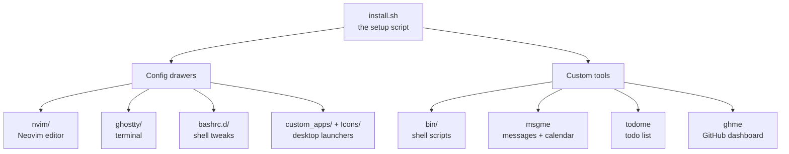
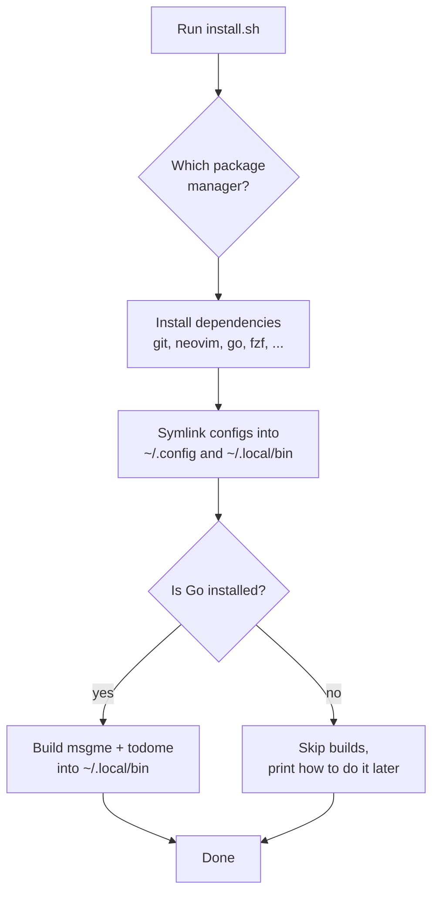
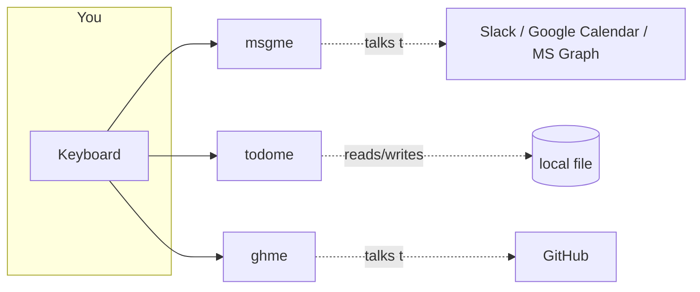
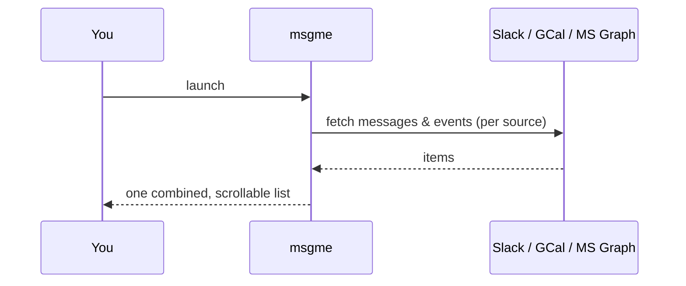

# dotfiles

> **In one sentence:** One repo that sets up a whole Linux workstation, the shell, the editor, the terminal, and a handful of custom terminal apps, with a single `install.sh` that wires everything into place.

This is a personal configuration repository ("dotfiles"). Dotfiles are the small hidden config files (their names start with a `.`) that programs read on startup. Instead of scattering them across the machine and forgetting how they were set up, they all live here in version control, and one script links them into the right places.

---

## Quick start

```bash
git clone <this-repo> ~/dotfiles
cd ~/dotfiles
./install.sh
```

`install.sh` figures out your Linux distribution, installs the packages it needs, symlinks the configs into your home directory, and builds the custom tools. Re-running it is safe.

---

## 1. What's in here?

Think of the repo as a toolbox with a few labelled drawers:



| Folder | What it is |
| --- | --- |
| `install.sh` | The one-shot installer. Detects the package manager, installs deps, symlinks configs, builds tools. |
| `bin/` | Small shell scripts that wrap and glue tools together (the `ghme*` family, `texera_start`). |
| `msgme/` | A custom terminal app: one inbox for Slack, Google Calendar, and Outlook/Teams. |
| `todome/` | A custom terminal app: a keyboard-driven todo list. |
| `ghme/` | A **third-party fork** of `gh-dash` (the GitHub dashboard). Left as upstream code. |
| `nvim/` | Neovim (text editor) configuration. |
| `ghostty/` | Configuration for the Ghostty terminal emulator. |
| `bashrc.d/` | Bits of shell setup loaded by `.bashrc`. |
| `custom_apps/`, `Icons/` | Desktop launcher entries and their icons. |
| `*-config/`, `gh-dash/` | Runtime config files the tools read at startup. |

---

## 2. How does the installer work?

`install.sh` is the front door. Most machines differ in which package manager they use (`apt`, `dnf`, `pacman`...), so the script first detects that, then maps the package names it needs onto whatever your system calls them.



**Symlinking** means the script doesn't copy files. It creates a pointer (a shortcut) from, say, `~/.config/nvim` back to `nvim/` in this repo. Edit the file once and both "places" change, because there is really only one file. Anything already sitting in the target path is backed up to a `.bak` file first, so nothing is lost.

Key links it creates:

| Repo folder | Symlinked to |
| --- | --- |
| `nvim/` | `~/.config/nvim` |
| `ghostty/` | `~/.config/ghostty` |
| `gh-dash/` | `~/.config/gh-dash` |
| `msgme-config/` | `~/.config/msgme` |
| `bin/*` | `~/.local/bin/*` |
| `bashrc.d/ghostty-title.sh` | `~/.bashrc.d/` |

---

## 3. The custom terminal tools

Three of these are full programs that run in the terminal. Two (`msgme`, `todome`) are written from scratch in Go; the third (`ghme`) drives a forked open-source dashboard. All three share the same look and feel: a text UI you drive entirely from the keyboard.



### msgme: one inbox for everything

`msgme` pulls messages and events from several services and shows them in one place, so you don't have to flip between a chat app, a calendar, and email.

- **Slack** (chat), **Google Calendar** (events), and **Microsoft Graph** (Outlook mail / Teams).
- Each service is a "source" behind a common interface, so adding another service is just adding one more source.
- Logging in uses OAuth (the "Sign in with..." flow). The first run opens a browser to grant access; tokens are cached so later runs are silent.
- It reads its settings from `~/.config/msgme/config.yml` (the `msgme-config/` folder).



### todome: a keyboard todo list

`todome` is a to-do manager that lives in the terminal. Add, edit, prioritise, and check off tasks without leaving the keyboard. Tasks are stored in a plain local file, so there is no account and no server.

### ghme: the GitHub dashboard (a fork)

`ghme/` is a **vendored fork** of [`dlvhdr/gh-dash`](https://github.com/dlvhdr/gh-dash), a rich terminal dashboard for GitHub pull requests and issues. It is kept here mostly as upstream code (it has its own `LICENSE`, `README`, and contributing docs). The personal layer is the `bin/ghme*` scripts that wrap it.

> Note: because `ghme/` is third-party code, it is intentionally **not** commented or modified like the rest of the repo. Treat it as an external dependency.

---

## 4. The `bin/` scripts (the glue)

These are short shell scripts that make daily workflows one command instead of ten. Most are a `ghme*` family that turns the GitHub dashboard into a full PR workflow.

| Script | What it does |
| --- | --- |
| `ghme` | Launches the GitHub dashboard (`gh dash`) with subcommands: review, update-all, repo, search, discussions. |
| `ghme-browser` | Opens a URL in the background so it doesn't scramble the terminal UI. |
| `ghme-checkout` | Checks out a PR's branch locally, fast-forwarding if possible. |
| `ghme-comments` | Renders a PR/issue conversation (reviews + inline code comments) in a readable paged layout. |
| `ghme-rebuild` | Rebuilds the vendored `gh-dash` and installs it as the `gh dash` binary. |
| `ghme-rerun-ci` | Retriggers a PR's CI by pushing an empty commit. |
| `texera_start` | A composable launcher for the Texera project (database, infra, app, dev/debug, docker/k8s), pinning JDK 17 + Node 24. |

---

## 5. Editor, terminal, and shell

### nvim/ (Neovim)

The editor config uses **lazy.nvim**, a plugin manager that downloads and loads editor add-ons on demand. Each file in `nvim/lua/plugins/` configures one plugin. The pieces, grouped by what they give you:

| Area | Plugins | What you get |
| --- | --- | --- |
| Finding things | `telescope` | Fuzzy search across files, buffers, text, and help. |
| Files | `neo-tree` | A file-explorer sidebar with git status. |
| Git | `gitsigns`, `diffview`, `git-conflict`, `lazygit` | Change markers in the gutter, side-by-side diffs, merge-conflict resolution, and a full Git UI. |
| Code intelligence | `lsp`, `cmp`, `mason-tools`, `treesitter` | Autocomplete, go-to-definition, diagnostics, and syntax-aware highlighting. |
| Languages | `java`, `scala`, `python` | Language-specific editing, debugging, and tests. |
| Debugging | `dap`, `python` (debugpy) | Set breakpoints and step through code. |
| Editing | `init` (multicursor), `smart-splits`, `toggleterm` | Multiple cursors, pane navigation, a pop-up terminal. |
| Visuals | `render-markdown`, `image`, `diagram` | Render markdown, images, and mermaid/d2 diagrams inline. |
| AI | `claude` | Claude Code inside the editor. |

`nvim/scripts/drawio_to_svg.py` is a small helper that converts drawio diagrams to SVG for inline viewing.

### ghostty/ (terminal)

Configuration for the Ghostty terminal emulator (fonts, colors, keybindings).

### bashrc.d/

Drop-in shell snippets. `ghostty-title.sh` keeps the terminal's title bar showing the current git branch by watching for branch changes in the background.

### custom_apps/ and Icons/

Desktop launcher files (`.desktop`) plus their icons, so custom apps show up in the system's application menu.

---

## 6. Why it's set up this way

| Without dotfiles | With this repo |
| --- | --- |
| Reconfigure each new machine by hand | `git clone` + `./install.sh` |
| Settings drift apart across machines | One source of truth, symlinked everywhere |
| "How did I set this up again?" | It's all in version control |
| Each tool configured in isolation | Tools share config, scripts, and look-and-feel |

The guiding idea: a new machine should go from blank to fully set up with one command, and any tweak made later is a normal git commit.

---

*Reference doc: high-level overview of the dotfiles repository. Source: repository structure and the per-component code comments added throughout `bin/`, `msgme/`, `todome/`, and `nvim/`.*
